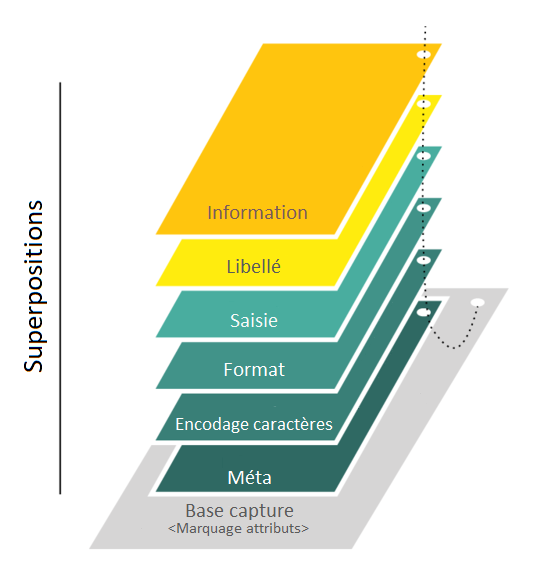

# _Overlay Capture Architecture (OCA)_ pour émettre des attestations multilingues incluant une image de marque (_branding_)
Voici les travaux réalisés dans le cadre d'une expérimentation visant à démontrer la pertinence d'utiliser le standard [Overlay Capture Architecture (OCA)](https://oca.colossi.network/) pour émettre des attestations multilingues incluant une image de marque (_branding_) tel que proposé dans la requête pour commentaires [ARIES RFC 0013: Overlays](https://github.com/hyperledger/aries-rfcs/blob/main/concepts/0013-overlays/README.md).

## 1.0 Objectifs
- Comprendre le standard _Overlay Capture Architecture (OCA)_;

- Modifier le portefeuille [ARIES Mobile Agent React Native](https://github.com/hyperledger/aries-mobile-agent-react-native) pour qu'il affiche une attestation en français-anglais incluant une image de marque (_branding_);

## 2.0 Contexte
_Overlay Capture Architecture (OCA)_ est une architecture de capture de données. Elle représente un schéma comme un objet multidimensionnel composé d'une base de capture stable et des superpositions liées qui viennent enrichir la base de capture.

<p align="center">
  

  <br>
  <b>Contexte de l'histoire d'Alice</b>
</p>

### Superposition de méta-information
Une superposition de méta-information peut être utilisée pour ajouter des informations contextuelles sur la base de capture, notamment son nom , sa description, etc.

### Superposition d'encodage de caractère
Une superposition d'encodage de caractère peut être utilisée pour définir l'encodage du jeu de caractères (par exemple UTF-8, ISO-8859-1, Windows-1251, Base58Check, etc.). Elle peut être utile pour mettre en œuvre des solutions qui facilitent la saisie de données dans plusieurs langues.

### Superposition de format
Une superposition de format peut être utilisée pour ajouter des formats, des longueurs de champ ou des schémas de codage de dictionnaire aux attributs de la base de capture.

### Superposition de saisie
Une superposition de saisie peut être utilisée pour ajouter des valeurs de champ prédéfinies dans une langue spécifiée aux attributs de la base de capture. Pour minimiser le risque de capture de données PII imprévues, il est préférable d'éviter la mise en œuvre de champs de texte libre. Ce type de superposition permet de saisir des données structurées, ce qui élimine le risque de capturer et de stocker ultérieurement des données dangereuses.

### Superposition de libellé
Une superposition de libellé peut être utilisée pour ajouter des étiquettes dans une langue spécifique aux attributs et aux catégories de la abse de capture. Ce type de superposition permet d'afficher les étiquettes dans une langue spécifique au niveau de la couche de présentation pour une meilleure compréhension par l'utilisateur final.

### Superposition d'information
Une superposition d'information peut être utilisée pour ajouter une prose pédagogique, informative ou juridique afin de faciliter le processus de saisie des données.

### Superposition de mise en page d'attestation
Une superposition de mise en page d'attestation peut être utilisée pour afficher les données capturées par le schéma avec, par exemple, une image de marque (_branding_). Elle permet le positionnement de texte (données et libellés), l'insertion d'images, etc. Les instructions pour définir la mise en page est un mixte de [YAML](https://yaml.org/) et de [CSS](https://fr.wikipedia.org/wiki/Feuilles_de_style_en_cascade).

### Paquet _Overlay Capture Architecture (OCA)_
La base de capture et les superpositions liées sont définit dans des documents au format JSON. Lors de la sauvegarde, ils sont insérés dans une archive au format zip. Ce dernier représente un paquet (_bundle_) _Overlay Capture Architecture (OCA)_.

### Identifiant auto adressable (_Self Addressing Identifier - SAI_)
Le base de capture et les superpositions sont liés ensemble par des identifiants auto-adressables. Un [identifiant auto-adressable](https://github-wiki-see.page/m/trustoverip/acdc-tf-terms/wiki/self-addressing-identifier-%28SAID%29) est un identifiant qui est généré de manière déterministe à partir du contenu qu'il identifie et qui y est intégré, ce qui le rend, ainsi que ses données, mutuellement inviolables. Ce type d'identifiant permet de s'assurer que le contenu qu'il identifie n'a pas été altéré. Un identifiant auto-adressable peut être calculé pour identifier un paquet _Overlay Capture Architecture (OCA)_. On peut ainsi s'assurer que ce dernier est authentique et qu'il n'a pas changé depuis sa création. 

## 3.0 Motivations
Le besoin initial qui a mené à cette expérimentation était de pouvoir émettre des attestations multilingues incluant une image de marque (_branding_). On peut penser à une attestation représentant un permis de conduire affichée dans le portefeuille sous forme de carte avec un logo du Québec et une image en arrière-plan. De plus, la traduction des attributs de l'attestation offre implicitement la possibilité de les afficher sous une forme plus lisible par un humain. Tel que décrit dans la requête pour commentaires [ARIES RFC 0043: I10n (Locali[s|z]ation)](https://github.com/hyperledger/aries-rfcs/blob/main/features/0043-l10n/README.md), le principal cas d'utilisation de DIDComm est la prise en charge du traitement automatisé, comme dans le cas des messages qui conduisent à la délivrance d'une attestation, à l'échange d'une preuve, etc. Le traitement automatisé peut être le seul moyen pour certains agents de traiter les messages, s'il s'agit de dispositifs ou de logiciels gérés par des organisations sans intervention humaine. Cependant, de nombreuses interactions requiert une intervention humaine. Par exemple, l'envoit d'une preuve à partir d'un portefeuille mobile. C'est pourquoi, losque des humains sont impliqués, la localisation et la traduction potentielle dans diverses langues naturelles deviennent importantes. Au moment d'écrire ces lignes, le statut de la requête pour commentaires [ARIES RFC 0043: I10n (Locali[s|z]ation)](https://github.com/hyperledger/aries-rfcs/blob/main/features/0043-l10n/README.md) est "Démontrée" mais elle n'a pas encore été implémentée. Comme le standard [_Overlay Capture Architecture (OCA_)](https://oca.colossi.network/) offre, entre autres, la possibilité de créer des superpositions de libellé dans différentes langues pour modifier le nom des attributs de la base de capture, cela rendait l'exécution de cette expérimentation très pertinente. D'autant plus que le standard Overlay Capture Architecture (OCA) offre beaucoup d'autres possibilités (format, encodage de caractère, valeurs de champ prédéfinies, etc.).

## 3.0 Environnement d\'expérimentation

### Construit avec
* [ReactNative](https://reactnative.dev/)

### Prérequis

* [npm](https://www.npmjs.com)
* [CANdy-Dev-Network](https://candy-dev.cloudcompass.ca/)
* Un téléphone ([iPhone](https://www.apple.com/ca/iphone) ou Android) ou [Android Studio](https://developer.android.com/studio)

### Facultatifs

* [VSCode](https://code.visualstudio.com)

### Installation
Suivre les instructions d'installation de la version [CQEN-QDCE](https://github.com/CQEN-QDCE) du portefeuille "ARIES Mobile Agent React Native". Utiliser la branche "[poc-oca](https://github.com/CQEN-QDCE/aries-mobile-agent-react-native/tree/poc-oca)" pour récupérer le code de l'expérimentation.


### 3.1 Conditions initiales et prémisses

## 4.0 ???

Pour cette expérimentation, il a été décidé de minimiser les modidifications à l'attestation pour lui associer un schéma OCA. Deux options semblaient possibles: 1-Ajouter une référence (SAI) vers le schéma OCA dans un attribut de l'attestation 2-Utiliser l'identifiant unique de la définition de l'attestation (Credential Definition) pour le récupérer. La deuxième option a été choisi. Elle a l'avantage de ne pas modifier l'attestation. Par contre, une référence (SAI) permettrait de créer un lien fort entre l'attestation et son schéma OCA. La référence pourrait également être le hash du schéma OCA. Il serait ainsi impossible de le modifier. 

Le schéma de l'attestation utilisé pour l'expérimentation est:
```json
{
  "schema_name": "QCPERSON",
  "schema_version": "1.0",
  "attributes": [
    "first_name",
    "last_name",
    "birth_date",
    "street_address",
    "city",
    "province",
    "country",
    "postal_code",
    "issued"
  ]
}
```
Il est disponible sur le registre de preuve [CANdy-Dev-Network](https://candy-dev.cloudcompass.ca/). Son identifiant est Ep31SvFAetugFPe5CGzJxt:2:QCPERSON:1.0. La définition d'attestation utilisée est Ep31SvFAetugFPe5CGzJxt:3:CL:25458:QCPERSON2.

Création de schéma OCA

Un [éditeur de schéma OCA](https://github.com/THCLab/oca-editor) est disponible sur le GitHub de [The Humain Colossus Lab](https://github.com/THCLab). En plus de permettre la création de schéma OCA et offre la possibilité de les publier dans un [dépôt commun](https://repository.oca.argo.colossi.network).

Le schéma OCA [schéma OCA de l'expérimentation](https://repository.oca.argo.colossi.network/api/v4/schemas/E0ttcf4zZhRiTkazvq8X4T69q3hzug6t8zR8mAaMCe1U) inclut deux couches de libellés, une en français et une en anglais. Une couche de format est également incluse pour personaliser les attributs "birth_date" et "issued". Les noms d'attribut de la couche de base sont les mêmes que ceux de l'attestation afin d'appliquer les différentes personalisation correctement.


Exemple de mise en page d'attestation:
P.S.: L'exemple ci-bas n'est pas fonctionnel. Il a été abrégé pour montrer uniquement les différentes instructions permettant la msie en page.
```
config:
  width: 400px
  height: 300px
pages:
  - config:
      style: \"width: 380px; height: 280px; margin: 10;\"
      background_image: SAI:zQmQg7JDptBT4CdfHuJNqfxpXf8AbvgdWes9h2731oF37ak
      name: Front
    elements:
      - type: row
        config:
          style: \"height: 30px;\"
...
                    elements:
                      - type: content
                        text: DL
                        config:
                          style: \"font-size: 14px; color: #1739ba; font-weight: bold; display: inline-block;\"
                      - type: attribute
                        name: drivingLicenseID
                        part: data
                        config:
                          style: \"display: inline-block; padding-left: 10px; text-transform: uppercase; font-size: 21px; color: #a62523;\"
...
```


# Intégration d'OCA dans Bifold
Plusieurs considérations doivent être prises en compte :
1. Quelles sont les fonctionnalités d'OCA qui nous intéressent (portéé);
2. À quel endroit on va stocker les schémas OCA;
3. Comment configurer Bifold pour retrouver le dépôt de schémas OCA;
4. Comment Bifold va appliquer le rendu des différentes couches OCA sur une attestation;

# 6.0 Résultats attendus
1. Un schéma au format _anoncred_ et une définition d'attestation associée sont enregistrées dans le registre de preuve [CANdy-Dev-Network](https://candy-dev.cloudcompass.ca/);
2. Un paquet _Overlay Capture Architecture (OCA)_ incluant une base de capture qui possède les mêmes attributs que l'attestation définie au point 1, une superposition de libellé en français, une superposition de libellé en anglais et une superposition de mise en page d'attestation est publié dans le [dépôt commun](https://repository.oca.argo.colossi.network);
3. L'attestation définie au point 1 est émise dans le portefeuille;
4. Lorsque l'attestation est affichée par le portefeuille, le paquet _Overlay Capture Architecture (OCA)_ qui lui est associé est récupéré dans le [dépôt commun](https://repository.oca.argo.colossi.network);
5. Le nom des attributs de l'attestation sont remplacés par ceux définit dans la superposition de libellé en français ou en anglais;
6. L'image de marque (_branding_) définie dans la superposition de mise en page d'attestation est affichée;

# 7.0 Analyse
L'expérimentation a permis de montrer qu'il est possible d'utiliser le standard _Overlay Capture Architecture (OCA)_ pour émettre une attestation multilingues incluant une image de marque (_branding_) et de l'afficher dans le portefeuille "ARIES Mobile Agent React Native". De plus, standard _Overlay Capture Architecture (OCA)_ offre d'autres possibilités comme l'identification des informations sensibles, l'encodage des caractères, la description d'attributs, etc. qui n'ont pas été explorées. L'intégration dans le portefeuille a été relativement rapide étant donné que des implémentations sont déjà disponibles.

## 7.1 Paquet _Overlay Capture Architecture (OCA)_
La création d'un paquet _Overlay Capture Architecture (OCA)_ est très simple en utilisant l'[éditeur de schéma OCA](https://github.com/THCLab/oca-editor). L'alignement des attributs de la base de capture avec ceux du schéma au format _anoncred_ peut représenter une source d'erreurs. L'outil devrait être modifié afin d'enrigistrer le schéma au format _anoncred_ et sa définition d'attestation (_credential definition_) automatiquement dans le registre de preuve (_Indy blockchain_) au moment de la publication du paquet.

## 7.2 Superposition de mise en page d'attestation
La creation d'une superposition de mise en page d'attestation pour ajouter une image de marque (_branding_) est plus complexe. Son format, basé sur un mixte de YAML et de CSS, est difficile à lire et à écrire. Aucun outil de pré-visualisation du rendu existe. Il serait pertinent d'en développer un pour  valider l'affichage de l,attestation avant la publication du paquet _Overlay Capture Architecture (OCA)_. Idéalement, un éditeur visuel de type _What You See - What You Get (WYSIWYG)_ serait la meilleure solution à fournir aux émetteurs d'attestation dans un environnement de production. 

Le rendu de l'image de marque de l'attestation a été implémenté avec la composante [React Native WebView](https://www.npmjs.com/package/react-native-webview). Bien que cette dernière offre une grande compatibilité pour l'affichage d'HTML-CSS-Javascript, le rendu final est assez lent (du moins avec l'émulateur de téléphone Android). Des essais de performance plus poussés devraient être effectués pour confirmer si ce choix est judicieux.


# 8.0 Conclusion
L'expérimentation a permis d'explorer la pertinence d'utiliser le standard _Overlay Capture Architecture (OCA)_ pour émettre des attestations multilingues incluant une image de marque (_branding_). Le résultat final s'est avéré concluant. Elle a également permis de découvrir que l,intégration du standard offre beaucoup plus (identification des inforamtions personnelles (PII), méta-information, encodage des caractères, valeurs de champ prédéfinies, format d'affichage, etc.). Un outil de création de formulaire de saisie OCA pour la capture de données est également disponible. Il a le potentiel d'être intégré à un coffre à outils plus générique offert aux émetteurs d'attestation. Ce dernier permettrait, par exemple, de créer visuellement une attestation (nom, version et attributs par glisser-déposer), de publier son schéma au format _anoncred_ dans le registre de preuves et son paquet _Overlay Capture Architecture (OCA)_ associé dans un dépôt commun. Et finalement cette attestation pourrait être offerte...
